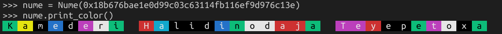

# nume: number name scheme

**v0.10.2-beta**

For too long have we had to communicate base-58 or hexadecimal numbers! And the auction-based name systems and first-come-first-serve name systems are not ideal either. This repo contains a new class of encoding scheme: _pronounceable_ (more-or-less) encodings.

The basic idea is the inversion of the usual approach to account names: force names upon the users, much like how they have gotten their own names.

The scheme implemented in only a relatively-few lines of python is a simple special case: two character sets of equal order. One set contains vowels and the other set contains consonants. Simply take a character from either set in an alternating fashion. With our character set selections, we have essentially base-40.

### Example
```python
>>> nume = to_nume(0x18b676bae1e0d99c03c63114fb116ef9d976c13e)
>>> print nume
Ķāmędèřï Ĥálidįņőďâĵä Ŧèŷepëŧőxä
>>> print hex(to_number(nume))
0x18b676bae1e0d99c03c63114fb116ef9d976c13e
```

### Possible Use for Accounts:
Since numes can be split up into three segments  (first, middle, last), an account could be displayed initially with only the first segment without any accent. Depending on the other numbers in the context, more initials/segments could be displayed as needed. Finally, all segments could be displayed with complete accents as the ultimate disambiguator.

#### Forms
```python
>>> nume = Nume(0x18b676bae1e0d99c03c63114fb116ef9d976c13e)
>>> print nume.get_form(0)
Kamederi
>>> print nume.get_form(1)
Kamederi T
>>> print nume.get_form(2)
Kamederi Teyepetoxa
>>> print nume.get_form(3)
Kamederi H Teyepetoxa
>>> print nume.get_form(4)
Kamederi Halidinodaja Teyepetoxa
>>> print nume.get_form(5)
Ķāmędèřï Ĥálidįņőďâĵä Ŧèŷepëŧőxä
```

#### Minimally unique forms
Given a set of numes, it is possible to find forms such that every represented nume is unique. These are referred to as 'minimally unique forms,' or 'MUFs.' Refer to the code for a definition of `test(...)` to better understand the following example:
```python
>>> mufs = test(2**16) # use 65536 random numbers (generate MUFs for ~65K Ethereum addresses)
>>> for muf in mufs[-20:]: # collisions are resolved last, so we can peek at the end of the list
...     print muf
...
Jizinure
Erisoday
Sugikofo
Osumuziz
Lagisite Z
Lagisite G
Itegagor U
Itegagor I
Raretosi R
Raretosi N
Yugewezi N
Yugewezi L
Epenitep U
Epenitep O
Otiwigoy U
Otiwigoy A
Zatotulu W
Zatotulu K
Udihikug Unituculet
Udihikug Uqolicusoc
```
(A much larger set is required to end up with some MUFs of a higher form when using random numbers.)

#### Other uses
This class of scheme could eventually make accounts more 'searchable.' A system could likely be implemented to result in an experience similar to how, in real life, you can tell someone your account name on a legacy social media platform, they search for it and show you the results,and you can point at the correct one.

##### Color-numes
Color-numes are an alternative to the complete, accented numes. To use colored numes, you need `colorama`.
```
$ pip install colorama
```
Once that's done:
```python
>>> nume = Nume(0x18b676bae1e0d99c03c63114fb116ef9d976c13e)
>>> nume.print_color()
```


### TODOs:
* Python3 support
* Implement as node module (in a separate repo once finalized)
* Transformation of color-nume back to a number (should be possible)

#### Non-normative notes:
* My earlier attempts at pronounceable encoding schemes envisioned 'asymmetrical' encoding, where the two character sets used were not isomorphic to eachother. While an interesting algorithm/formula for determining the number of elements per 'digit' was discovered, it was not that useful and no efficient conversion algorithm was discovered. Had such an algorithm been discovered, the next progression would have been dynamic character sets that would permit consecutive consonants and vowels if they were part of common sequences (such as 'tr', 'th', and so on). Despair took over and I implemented the special case on my flight back from Prague. — {;

### Changelog
* v0.10.2-beta:
    * Changed character sets again.
    * Added `print_color()` method to Nume class.
* v0.10.1-beta:
    * Added two more intermediary forms (initials).
* v0.10.0-beta:
    * Changed character sets.
    * Corrected some accent descriptions.
* v0.9.2 (Nov 17, 2018):
    * Update README.
    * Add accent descriptions to better support future experiments in improving 'searchability.'
    * Fix order of 'R' characters.
* v0.9.1-b (Nov 16, 2018):
    * Add MUFs.
* v0.9.1 (Nov 14, 2018):
    * Implement conversion of nume back to number.
* v0.9.0 (Nov 4, 2018):
    * Implement conversion of number to 'nume.'